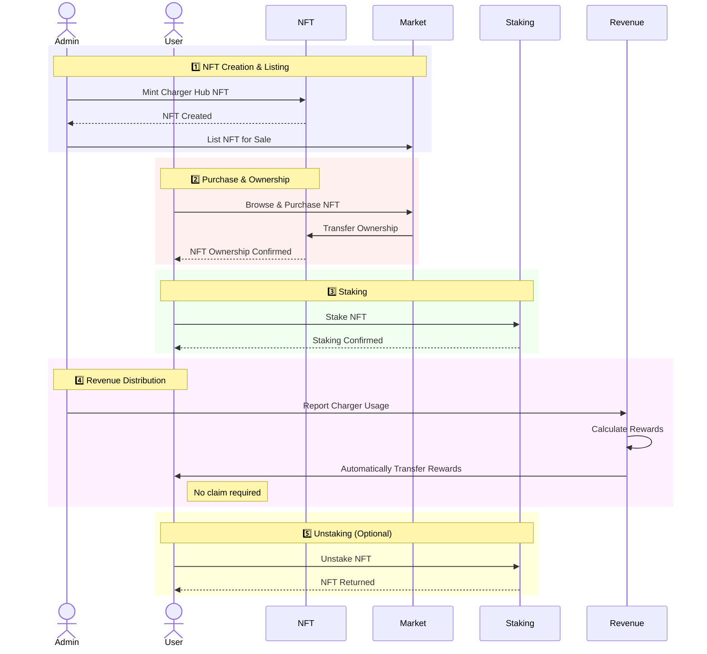

# PiggyCell - Web3-based Decentralized Charging Infrastructure Platform

PiggyCell is a Web3-based decentralized charging infrastructure platform that tokenizes mobile phone charging hubs into NFTs (Non-Fungible Tokens) and provides a staking mechanism for user participation and rewards. This project builds a system that issues NFTs linked to charging hubs and allows users to stake these NFTs to receive a portion of the revenue generated from charger usage. This enables anyone to invest in charging infrastructure and earn profits, presenting a transparent and efficient revenue distribution model.

## Service Flow



## Features

- **NFT Management**: Create and manage NFTs representing real-world charging hubs using the ICRC-7 standard
- **Token System**: Utilize the ICRC-1 and ICRC-2 standards for the platform's token economy
- **Staking Mechanism**: Allow users to stake their NFTs to participate in revenue sharing
- **Automatic Revenue Distribution**: Calculate and automatically distribute revenue from charger usage to NFT stakers without requiring claims
- **Admin Controls**: Secured administrative functions for platform management
- **Initial NFT Marketplace**: Purchase charging hub NFTs from the platform (initial sales only)

## Tech Stack

- **Backend**: Motoko on Internet Computer
- **Frontend**: React.js
- **Standards**: ICRC-1, ICRC-2, ICRC-3, ICRC-7
- **Authentication**: Internet Identity

## Project Structure

```
piggycell/
├── src/
│   ├── piggycell_backend/     # Motoko canisters
│   │   ├── main.mo            # Main canister
│   │   ├── ChargerHubNFT.mo   # NFT implementation
│   │   ├── PiggyCellToken.mo  # Token implementation
│   │   ├── Staking.mo         # Staking logic
│   │   ├── Market.mo          # Marketplace functions
│   │   ├── RevenueDistribution.mo # Revenue distribution
│   │   └── Admin.mo           # Admin functions
│   │
│   └── piggycell_frontend/    # Frontend UI
│       ├── src/               # React components and logic
│       ├── public/            # Static assets
│       └── ...                # Configuration files
│
├── dfx.json                   # Project configuration
└── ...                        # Other configuration files
```

## Running the Project Locally

To test the project locally, use the following commands:

```bash
# Start the replica in the background
dfx start --background

# Deploy canisters to the replica and generate candid interface
dfx deploy
```

After completion, your application will be available at `http://localhost:4943?canisterId={asset_canister_id}`.

If you've made changes to your backend canister, generate a new candid interface with:

```bash
npm run generate
```

For frontend development, start a development server with:

```bash
npm start
```

This will start a server at `http://localhost:8080`, proxying API requests to the replica at port 4943.

## Frontend Environment Variables

If you're hosting frontend code somewhere without using DFX, you may need to make one of the following adjustments to ensure your project doesn't fetch the root key in production:

- Set `DFX_NETWORK` to `ic` if you're using Webpack
- Use your own preferred method to replace `process.env.DFX_NETWORK` in the autogenerated declarations
  - Setting `canisters -> {asset_canister_id} -> declarations -> env_override` to a string in `dfx.json` will replace `process.env.DFX_NETWORK` with that string in autogenerated declarations
- Write your own `createActor` constructor

## License

This project is licensed under the MIT License - see the LICENSE file for details.

## Contact

For questions or inquiries, please open an issue in this repository.
